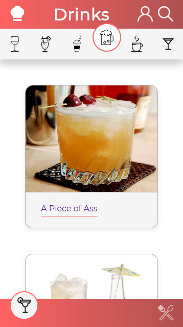

# Recipes App project

This project was developed during the [Trybe's](https://www.betrybe.com/) Front-end module.
This was a group project in which we developed a recipe app working with agile methodologies and using the most modern features of the React ecosystem: Hooks and Redux.

## Overview

This project was built with React Redux

Users should be able to:

- See both foods and drinks recipes;
- Filter recipes by ingredients, by name or first letter;
- Favorite recipes and access them on a different page;
- Start and finish a recipe;
- View finished recipes;

### Demo
- [Live project](https://viniciuslacerda-recipes-app.vercel.app/)

### Screenshots

  
  
  
  
  
  
  
  

### Local usage
- Clone this repository;
- Access the local repository folder;
- run $ npm install;
- run $ npm start.
